# Архитектурные схемы ZoomUploader / LEAP Platform

Уникальные Mermaid-схемы системы. Каждая диаграмма описывает отдельный аспект архитектуры.

---

## Содержание

1. [POST /run — логика по статусу](#1-post-run--логика-по-статусу)
2. [Recording FSM (State Machine)](#2-recording-fsm-state-machine)
3. [Pause Flow](#3-pause-flow)
4. [Resume Flow](#4-resume-flow)
5. [Zoom Credentials (Master Account)](#5-zoom-credentials-master-account)
6. [Configuration Hierarchy](#6-configuration-hierarchy)
7. [Template Matching](#7-template-matching)
8. [Pipeline: Input Sources → Upload](#8-pipeline-input-sources--upload)
9. [API Layers](#9-api-layers)
10. [Multi-Tenancy](#10-multi-tenancy)
11. [Celery Async Processing](#11-celery-async-processing)
12. [Quota System](#12-quota-system)
13. [Credential Encryption](#13-credential-encryption)
14. [Output Target FSM](#14-output-target-fsm)
15. [Automation Job Flow](#15-automation-job-flow)
16. [Deletion / Retention FSM](#16-deletion--retention-fsm)
17. [Task Chain (run_recording)](#17-task-chain-run_recording)
18. [Storage Structure](#18-storage-structure)
19. [SourceType → Downloader](#19-sourcetype--downloader)
20. [Entity Relationships](#20-entity-relationships)
21. [Общая схема: Credentials, Sources, Presets, Templates, Automation](#21-общая-схема-credentials-sources-presets-templates-automation)

---

## 1. POST /run — логика по статусу

**Упрощённо:** статус определяет действие. Пауза = можно снять; уже идёт = 409; терминальные = 409 или «готово».

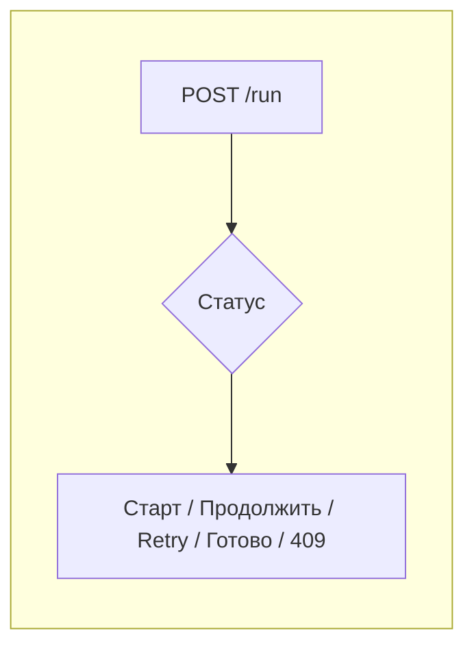

**Подробно:**

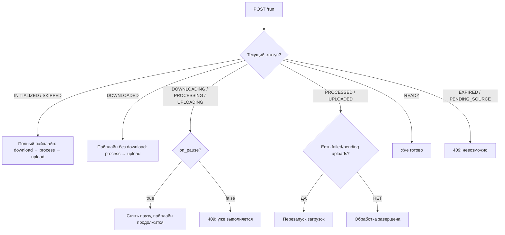

---

## 2. Recording FSM (State Machine)

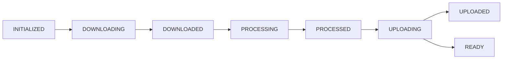

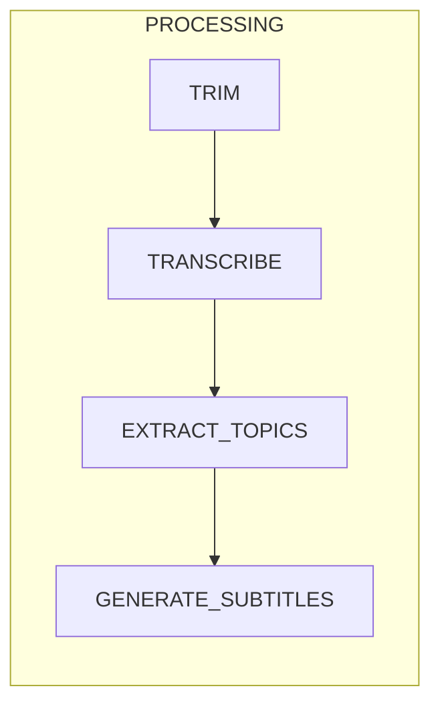

**Основной поток:** download → process → upload. При ошибке — откат к предыдущей стадии. Пауза проверяется в DOWNLOADING, PROCESSING, UPLOADING.

---

## 3. Pause Flow

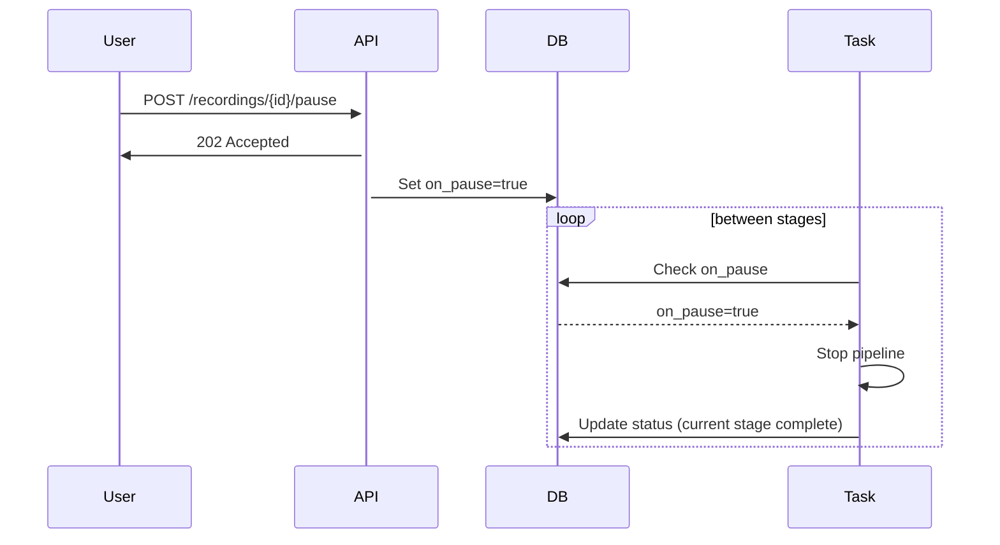

---

## 4. Resume Flow

**Важно:** Параметр `resume=true` не используется — единый smart `/run` сам определяет действие по статусу. Resume срабатывает, когда статус DOWNLOADING/PROCESSING/UPLOADING и `on_pause=true`.

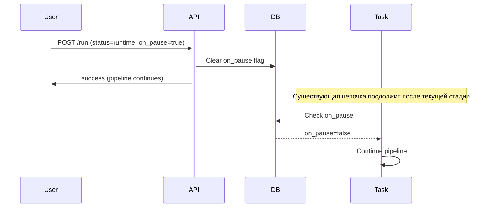

---

## 5. Zoom Credentials (Master Account)

**Упрощённо:** один Master Credential создаёт временные креды для каждого под-аккаунта.

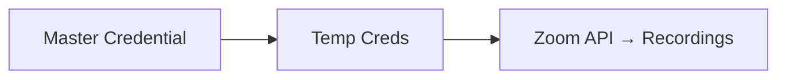

**Подробно:**

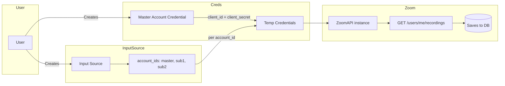

---

## 6. Templates, Overrides и Resolution

### 6.0 Упрощённо

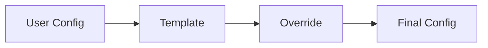

**Идея:** База (User) → дополняет Template (если есть) → перекрывает Override (если задан). Всё мержится, побеждает верхний уровень.

---

### 6.1 Цепочка: Sync → Match → Config → Processing

```mermaid
flowchart TB
    subgraph Sources["Источники конфига"]
        UC[User Config (user_configs)]
        T[Template: rules, processing, output, metadata]
        RO[Recording Override (processing_preferences)]
    end

    subgraph Flow["Жизненный цикл"]
        S[Recording synced] --> M{Template match?}
        M -->|да| B[recording.template_id]
        M -->|нет| U[Unmapped]
        B --> R[ConfigResolver]
        U --> R
    end

    subgraph Merge["Resolution: base → override"]
        direction TB
        R --> M1[1. User Config base]
        M1 --> M2[2. Template Config (если template_id)]
        M2 --> M3[3. Recording Override]
        M3 --> FC[Final Config]
    end

    UC --> M1
    T --> M2
    RO --> M3

    FC --> P[Processing / Upload]
```

### 6.2 Приоритет по типам конфига

| Тип | Order 1 (base) | Order 2 | Order 3 (override) |
|-----|----------------|---------|--------------------|
| **processing_config** | user_config.processing | template.processing_config | recording.processing_preferences |
| **output_config** | user_config.output | template.output_config | processing_preferences.output_config |
| **metadata_config** | user_config.metadata | template.metadata_config | processing_preferences.metadata_config |
| **upload metadata** *(per preset)* | preset.preset_metadata | template.metadata_config | processing_preferences.metadata_config |

Deep merge: каждый следующий уровень перезаписывает поля предыдущего. Вложенные объекты мержатся рекурсивно.

### 6.3 Template Matching

**Упрощённо:** запись проверяется по шаблонам, первый подходящий — побеждает.

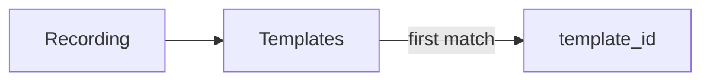

Порядок проверки для каждого шаблона (по `created_at` ASC): `source_ids` → exclude → exact/keywords/patterns.

**Подробно:**

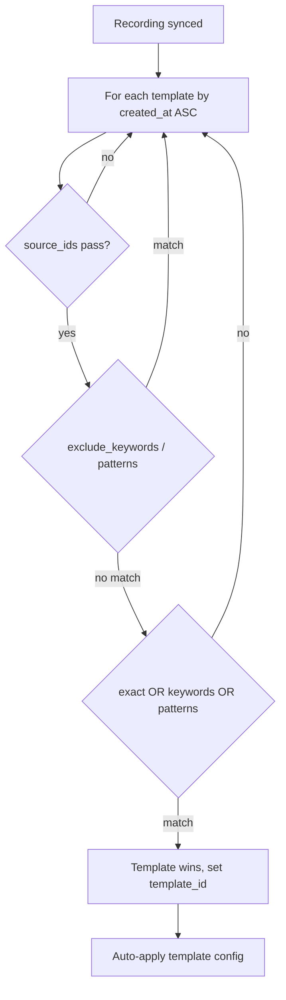

### 6.4 Связь Recording → Template → Presets

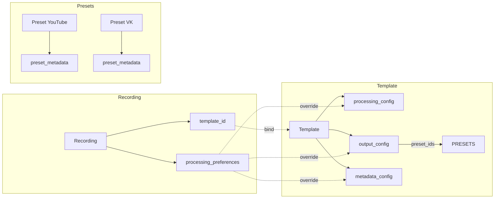

**Итог:** Template задаёт обработку и куда выгружать. Recording Override точечно переопределяет настройки для конкретной записи.

---

## 8. Pipeline: Input Sources → Upload

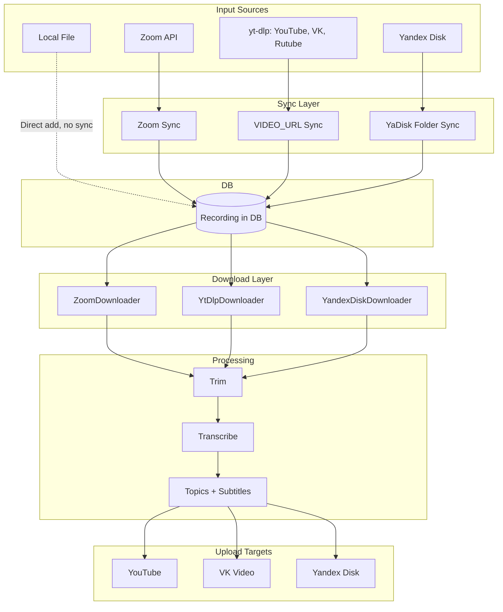

---

## 9. API Layers

```mermaid
flowchart TD
    subgraph Client
        C[REST API + JWT Auth]
    end

    subgraph Service
        RS[RecordingService]
        TS[TemplateService]
        AS[AutomationService]
        CR[CredentialService]
        US[UserService]
        UPS[UploadService]
    end

    subgraph Repository
        REPO[SQLAlchemy ORM (multi-tenant)]
    end

    subgraph Data
        PG[(PostgreSQL)]
    end

    C --> Service
    Service --> REPO
    REPO --> PG
```

---

## 10. Multi-Tenancy

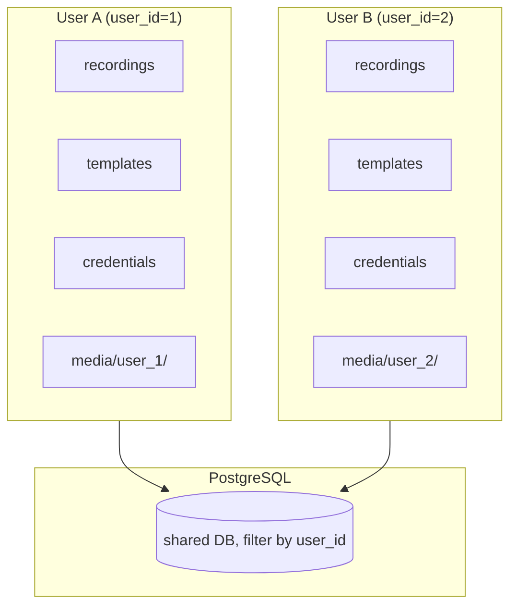

---

## 11. Celery Async Processing

**Упрощённо:**

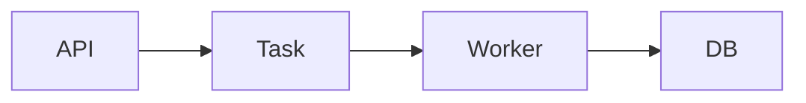

**Подробно:**

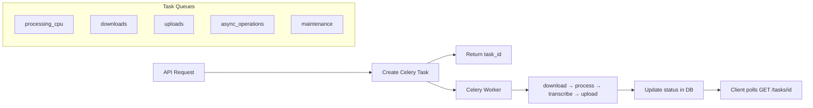

---

## 12. Quota System

```mermaid
flowchart TD
    DQ[DEFAULT_QUOTAS (settings)] --> SP[subscription_plans]
    SP --> US[user_subscriptions (plan + overrides)]
    US --> QU[quota_usage (period YYYYMM)]
    QU --> QC[Quota checks before ops]
```

---

## 13. Credential Encryption

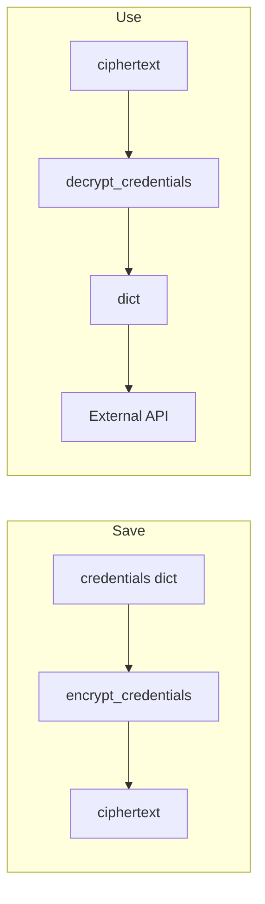

**Key:** SECURITY_ENCRYPTION_KEY (Fernet, base64 32 bytes)

---

## 14. Output Target FSM

```mermaid
flowchart LR
    N[NOT_UPLOADED] --> U[UPLOADING]
    U --> OK[UPLOADED]
    U --> F[FAILED]
    F -.->|/run retry| U
```

Один output target (YouTube, VK и т.д.) на запись. FAILED → повтор через `/run`.

---

## 15. Automation Job Flow

**Упрощённо:**

```mermaid
flowchart LR
    J[Job] --> S[Sync sources] --> M[Match templates] --> P[Process]
```

**Подробно:**

```mermaid
flowchart TD
    A[Celery Beat trigger] --> B[Load templates]
    B --> C[Collect source_ids from matching_rules]
    C --> D{source_ids empty?}
    D -->|yes| E[Sync ALL active sources]
    D -->|no| F[Sync specified sources only]
    E --> G[Sync recordings]
    F --> G
    G --> H[Filter by automation filters]
    H --> I[Match recordings with templates]
    I --> J[Process matched recordings]
```

---

## 16. Deletion / Retention FSM

**Упрощённо:**

```mermaid
flowchart LR
    A[active] --> S[soft: файлы] --> H[hard: из БД]
```

**Подробно:**

```mermaid
flowchart LR
    A[active] -->|DELETE / expire_at| S[soft]
    S -->|soft_deleted_at (maintenance)| H[hard]
    H -->|hard_delete_at (maintenance)| X[deleted from DB]

    S -.->|/restore| A
```

**Триггеры:** `expire_at` — auto_expire_recordings_task (3:30 UTC). `soft_deleted_at` — cleanup_recordings_task (удаление файлов). `hard_delete_at` — hard_delete_recordings_task (5:00 UTC).

---

## 17. Task Chain (run_recording_task)

**Упрощённо:**

```mermaid
flowchart LR
    D[download] --> P[process] --> U[upload]
```

**Подробно:**

```mermaid
flowchart LR
    D[download] --> T[trim]
    T --> TR[transcribe]
    TR --> P{parallel}
    P --> E[extract_topics]
    P --> S[generate_subtitles]
    E --> U[launch_uploads]
    S --> U
```

Цепочка Celery: `chain(download, trim, transcribe, group(extract_topics, generate_subtitles), launch_uploads)`. Extract topics и subtitles выполняются параллельно после transcribe.

---

## 18. Storage Structure

**Упрощённо:**

```mermaid
flowchart LR
    U[user_XXXXX] --> R[recordings/id] --> F[source, video, transcriptions]
```

**Подробно:**

```mermaid
flowchart TD
    subgraph storage["storage/"]
        subgraph users["users/"]
            subgraph user["user_000001/"]
                rec["recordings/"]
                thumb["thumbnails/"]
            end
        end
        subgraph shared["shared/"]
            st["thumbnails/"]
        end
        temp["temp/"]
    end

    rec --> r74["74/"]
    r74 --> src["source.mp4"]
    r74 --> vid["video.mp4"]
    r74 --> aud["audio.mp3"]
    r74 --> trans["transcriptions/"]
    trans --> master["master.json"]
    trans --> extr["extracted.json"]
    trans --> srt["subtitles.srt"]
```

---

## 19. SourceType → Downloader

```mermaid
flowchart LR
    Z[ZOOM] --> ZD[ZoomDownloader]
    E[EXTERNAL_URL] --> YD[YtDlpDownloader]
    Y[YOUTUBE] --> YD
    YA[YANDEX_DISK] --> YAD[YandexDiskDownloader]
```

`create_downloader(source_type)` — factory в `video_download_module/factory.py`.

---

## 20. Entity Relationships

```mermaid
erDiagram
    User ||--o{ InputSource : has
    User ||--o{ RecordingTemplate : has
    User ||--o{ OutputPreset : has
    User ||--o{ UserCredential : has
    User ||--o{ Recording : owns

    Recording }o--|| InputSource : from
    Recording }o--o| RecordingTemplate : uses
    Recording ||--o{ OutputTarget : has

    InputSource }o--o| UserCredential : uses
    OutputPreset }o--|| UserCredential : uses

    RecordingTemplate ||--o{ OutputPreset : references
```

---

## 21. Общая схема: Credentials, Sources, Presets, Templates, Automation

### 21.0 Упрощённо

```mermaid
flowchart LR
    C[Credentials] --> IS[Input Sources]
    C --> P[Presets]
    IS --> R[Recordings]
    T[Templates] --> R
    T --> P
    A[Automation] --> T
    A --> IS
```

**Идея:** Credentials питают Sources (откуда) и Presets (куда). Templates матчат Recordings и задают config + presets. Automation запускает Sync из Sources и Process по Templates.

---

### 21.1 Credentials (креды)

Платформа → credential. Используются в Input Sources (sync) и Output Presets (upload).

```mermaid
flowchart TB
    subgraph Platforms["Платформы"]
        Z[Zoom]
        YT[YouTube]
        VK[VK]
        YD[Yandex Disk]
    end

    subgraph Uses["Кто использует"]
        IS[Input Source (sync, скачивание)]
        OP[Output Preset (upload, выгрузка)]
    end

    Z --> IS
    YT --> OP
    VK --> OP
    YD --> IS
    YD --> OP
```

| Платформа | Input Source | Output Preset |
|-----------|--------------|---------------|
| Zoom | ✅ | — |
| YouTube | — | ✅ |
| VK | — | ✅ |
| Yandex Disk | ✅ | ✅ |

---

### 21.2 Input Sources (источники)

Определяют, **откуда** приходят записи. Связаны с credential (кроме LOCAL, VIDEO_URL).

```mermaid
flowchart LR
    IS[Input Source] -->|credential_id| C[Credential]
    IS -->|config| CFG[account_ids, folder, user_emails...]
    IS -->|sync| R[Recordings]
```

**Типы:** ZOOM, YANDEX_DISK, VIDEO_URL, LOCAL.

---

### 21.3 Output Presets (пресеты)

Определяют, **куда** выгружать. Содержат credential + metadata (privacy, description_template и т.д.).

```mermaid
flowchart LR
    OP[Output Preset] -->|credential_id| C[Credential]
    OP -->|preset_metadata| M[privacy, playlist, templates...]
    T[Template] -->|output_config.preset_ids| OP
```

**Платформы:** youtube, vk, yandex_disk.

---

### 21.4 Templates (шаблоны)

Матрчат записи и задают конфиг: как обрабатывать и куда выгружать.

```mermaid
flowchart LR
    T[Template] -->|matching_rules| M[Match Recordings]
    T -->|processing_config| PC[trim, transcribe, topics...]
    T -->|output_config| OC[preset_ids, auto_upload]
    T -->|metadata_config| MC[title, description]
    OC --> P[Presets]
```

---

### 21.5 Automation (автоматизация)

Периодически: Sync из Sources → Match → Process по Templates.

```mermaid
flowchart TD
    A[Automation Job] -->|template_ids| T[Templates]
    T -->|source_ids из matching_rules| IS[Input Sources]
    A -->|schedule| BEAT[Celery Beat]
    BEAT --> SYNC[Sync Sources]
    SYNC --> MATCH[Match Templates]
    MATCH --> PROCESS[Process Recordings]
```

---

### 21.6 Полная схема

```mermaid
flowchart TB
    subgraph User
        U[User]
    end

    subgraph Creds
        C1[Zoom Cred]
        C2[YouTube Cred]
        C3[VK Cred]
    end

    subgraph Input
        IS1[Input Source Zoom]
        IS2[Input Source YaDisk]
    end

    subgraph Presets
        P1[YouTube Preset]
        P2[VK Preset]
    end

    subgraph Templates
        TM[Template]
    end

    subgraph Automation
        AJ[Automation Job]
    end

    U --> C1
    U --> C2
    U --> C3
    C1 --> IS1
    C2 --> P1
    C3 --> P2
    IS1 --> R[(Recordings)]
    IS2 --> R
    TM --> R
    TM --> P1
    TM --> P2
    AJ --> TM
    AJ --> IS1
```

---

## См. также

- [ADR_OVERVIEW.md](ADR_OVERVIEW.md) — Architecture Decision Records
- [TECHNICAL.md](TECHNICAL.md) — Полная техническая документация
- [TEMPLATES_PRESETS_SOURCES_GUIDE.md](guides/TEMPLATES_PRESETS_SOURCES_GUIDE.md) — Templates, Presets, Sources
- [ZOOM_CREDS_GUIDE.md](guides/ZOOM_CREDS_GUIDE.md) — Zoom credentials
- [CREDENTIAL_SECURITY.md](guides/CREDENTIAL_SECURITY.md) — Шифрование credentials
