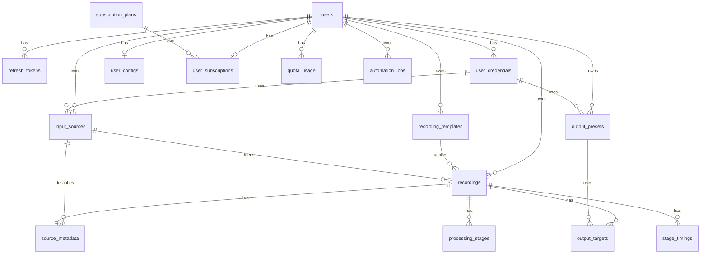

# Database Design — LEAP / ZoomUploader

**Alembic:** 17 ревизий (`001` … `017`)
**Последнее обновление:** март 2026
**СУБД:** PostgreSQL 12+

Источник истины по схеме: каталог `alembic/versions/` и SQLAlchemy-модели в `database/*.py`.

---

## Содержание

1. [Обзор](#обзор)
2. [Схема связей](#схема-связей)
3. [Таблицы по доменам](#таблицы-по-доменам)
4. [Перечисления (enum)](#перечисления-enum)
5. [JSONB и конфигурации](#jsonb-и-конфигурации)
6. [Индексы и производительность](#индексы-и-производительность)
7. [Планировщик Celery (SQL)](#планировщик-celery-sql)
8. [Миграции и команды](#миграции-и-команды)
9. [См. также](#см-также)

---

## Обзор

### Статистика

| Категория | Таблицы |
|-----------|---------|
| Аутентификация и пользователи | `users`, `refresh_tokens`, `user_credentials` |
| Подписки и квоты | `subscription_plans`, `user_subscriptions`, `quota_usage` |
| Конфигурация | `user_configs`, `base_configs` |
| Шаблоны и источники/пресеты | `recording_templates`, `input_sources`, `output_presets` |
| Обработка записей | `recordings`, `source_metadata`, `output_targets`, `processing_stages`, `stage_timings` |
| Автоматизация | `automation_jobs` |
| Celery Beat (django-celery-beat–совместимая схема) | `celery_interval_schedule`, `celery_crontab_schedule`, `celery_solar_schedule`, `celery_periodic_task_changed`, `celery_periodic_task` |

**Итого:** 17 доменных таблиц + 5 служебных для Beat (см. миграцию `008_create_celery_beat_tables.py`). Таблица `quota_change_history` удалена в `017`.

### Multi-tenancy

**Стратегия:** одна БД, изоляция по `user_id` (строка ULID, `VARCHAR(26)`).

Везде, где есть `user_id`, FK: `REFERENCES users(id) ON DELETE CASCADE` (кроме явно оговорённых `SET NULL` / `RESTRICT`). Фильтрация по текущему пользователю — на уровне слоя доступа к данным (репозитории / сервисы).

---

## Схема связей



**Автоматизация:** в `automation_jobs` нет FK на шаблоны — список `template_ids` хранится как `INTEGER[]`; источники и расписание задаются JSON-полями (`schedule`, `sync_config`, `filters`).

---

## Таблицы по доменам

Ниже — назначение и ключевые поля. Точные типы и ограничения — в миграциях и моделях.

### Аутентификация и пользователи

| Таблица | Модель | Назначение |
|---------|--------|------------|
| `users` | `UserModel` | ULID `id`, последовательный `user_slug` (пути хранилища), email, пароль, `role`, RBAC-флаги `can_*`, `timezone`, метки времени |
| `refresh_tokens` | `RefreshTokenModel` | `user_id`, `token`, `expires_at`, `is_revoked`, `created_at` |
| `user_credentials` | `UserCredentialModel` | Платформа (`zoom`, `youtube`, …), `account_name`, `encrypted_data` (Fernet), `is_active`; уникальность `(user_id, platform, account_name)` — миграция `015` |

### Подписки и квоты

| Таблица | Модель | Назначение |
|---------|--------|------------|
| `subscription_plans` | `SubscriptionPlanModel` | Тарифы, лимиты, цены (`Numeric`) |
| `user_subscriptions` | `UserSubscriptionModel` | Один ряд на пользователя: `plan_id`, кастомные лимиты, pay-as-you-go, период |
| `quota_usage` | `QuotaUsageModel` | Учёт по месяцам: `period` **INTEGER** (`YYYYMM`, например `202603`), `recordings_count`, `storage_bytes`, `concurrent_tasks_count`, `overage_*`; уникальность `(user_id, period)` в БД **не задана** — логика выбора в `QuotaUsageRepository` |

Дефолтные лимиты без подписки: `config.settings.DEFAULT_QUOTAS`.

### Конфигурация

| Таблица | Модель | Назначение |
|---------|--------|------------|
| `user_configs` | `UserConfigModel` | **Один** JSONB `config_data` на пользователя (не отдельные колонки `processing_config` / …) |
| `base_configs` | `BaseConfigModel` | Именованные конфиги с `config_type`; `user_id` NULL = глобальный |

### Шаблоны, источники, пресеты

| Таблица | Модель | Назначение |
|---------|--------|------------|
| `recording_templates` | `RecordingTemplateModel` | `matching_rules`, `processing_config`, `metadata_config`, `output_config`; `used_count`, `last_used_at`; уникальность `(user_id, name)` |
| `input_sources` | `InputSourceModel` | `source_type`, `credential_id`, `config`; уникальность `(user_id, name, source_type, credential_id)` |
| `output_presets` | `OutputPresetModel` | `platform`, `credential_id`, `preset_metadata`; уникальность `(user_id, name)` |

### Обработка записей

| Таблица | Модель | Назначение |
|---------|--------|------------|
| `recordings` | `RecordingModel` | Агрегатный статус `processingstatus` (enum), `duration` / `final_duration` (**Float**, секунды), пути к файлам, JSONB транскрипции/тем, `failed` + `failed_*`, **pipeline** (`pipeline_started_at`, `pipeline_completed_at`, `pipeline_duration_seconds`), **пауза** (`on_pause`, `pause_requested_at`), soft/hard delete |
| `source_metadata` | `SourceMetadataModel` | 1:1 с записью: `source_type` (enum `sourcetype`), `source_key`, колонка БД `metadata` (в ORM — атрибут `meta`) |
| `output_targets` | `OutputTargetModel` | `target_type` / `status` (enum), `preset_id`, `target_meta`, `started_at`, `uploaded_at`, ошибки загрузки |
| `processing_stages` | `ProcessingStageModel` | Этапы пайплайна (`processingstagetype`), статус этапа (`processingstagestatus`), `started_at`, `completed_at`, `skip_reason`, `stage_meta` |
| `stage_timings` | `StageTimingModel` | Append-only метрики: `stage_type`, `substep`, `attempt`, интервалы, `status`, `meta` (миграция `014`) |

---

## Перечисления (enum)

Актуальные значения для прикладной логики заданы в `models/recording.py` и используются в SQLAlchemy `Enum`.

| Тип | Назначение | Значения (логика приложения) |
|-----|------------|------------------------------|
| `processingstatus` | Статус записи | `PENDING_SOURCE`, `INITIALIZED`, `DOWNLOADING`, `DOWNLOADED`, `PROCESSING`, `PROCESSED`, `UPLOADING`, `UPLOADED`, `READY`, `SKIPPED`, `EXPIRED`. Сбой учитывается полями `failed`, `failed_reason`, а не значением `FAILED` в enum |
| `processingstagetype` | Этап обработки | `DOWNLOAD`, `TRIM`, `TRANSCRIBE`, `EXTRACT_TOPICS`, `GENERATE_SUBTITLES` (доп. значения могут добавляться миграциями `ALTER TYPE … ADD VALUE`) |
| `processingstagestatus` | Статус этапа | `PENDING`, `IN_PROGRESS`, `COMPLETED`, `FAILED`, `SKIPPED` |
| `sourcetype` | Источник | `ZOOM`, `LOCAL_FILE`, `GOOGLE_DRIVE`, `YANDEX_DISK`, `YOUTUBE`, `EXTERNAL_URL`, `OTHER`, … (расширялось в `012`) |
| `targettype` / `targetstatus` | Выгрузка | Типы площадок и статусы загрузки — см. `TargetType`, `TargetStatus` в `models/recording.py` |

Исторические значения enum в PostgreSQL могут сохраняться после миграций; для отчётов и API ориентируйтесь на код модели и фактические данные.

---

## JSONB и конфигурации

| Поле / таблица | Где описан формат |
|----------------|-------------------|
| `user_configs.config_data` | Pydantic `UserConfigData` в `api/schemas/config/user_config.py` (trimming, transcription, download, upload, metadata, retention, platforms) |
| `recording_templates.*_config`, `matching_rules` | Шаблоны конфигурации и матчинг — `api/schemas/template/`, `docs/guides/TEMPLATES.md` |
| `user_credentials.encrypted_data` | Зашифрованный JSON учётных данных (см. `docs/guides/OAUTH.md`) |
| `output_presets.preset_metadata` | Платформенные метаданные — `api/schemas/template/preset_metadata.py` |
| `input_sources.config` | Зависит от `source_type` (например Zoom — см. использование в сервисах синхронизации) |
| `automation_jobs.schedule` | `api/schemas/automation/schedule.py` — типизированный `Schedule` |
| `automation_jobs.sync_config` | `SyncConfig` в `api/schemas/automation/job.py` (`sync_days`) |
| `automation_jobs.filters` | `AutomationFilters` в `api/schemas/automation/filters.py` |
| `automation_jobs.processing_config` | Опциональный dict-override под конкретный прогон |

Пример структуры шаблона (сокращённо):

```json
{
  "exact_matches": ["Lecture: ML"],
  "keywords": ["ML", "AI"],
  "match_mode": "any"
}
```

---

## Индексы и производительность

- Имена и состав индексов задаются в миграциях (начиная с `001`); в моделях часть полей помечена `index=True` — при расхождении с миграциями приоритет у **фактической схемы БД** после `alembic upgrade head`.
- **GIN** по JSONB в текущих миграциях не создаётся; при необходимости полнотекстового/ключевого поиска по JSON — отдельное проектное решение.
- Частичные индексы в документации старой версии не соответствовали репозиторию; проверяйте `alembic/versions/`.
- Практики: `get_by_user_and_period` для квот, выборки по `user_id` + сортировка по времени для списков записей; у `RecordingModel` основные связи загружаются через `selectin`, `stage_timings` по умолчанию `noload` (см. `database/models.py`).

---

## Планировщик Celery (SQL)

Миграция `008` создаёт набор таблиц для **celery-sqlalchemy-scheduler** (схема по смыслу близка к django-celery-beat):

- `celery_interval_schedule`, `celery_crontab_schedule`, `celery_solar_schedule`
- `celery_periodic_task` — связь задачи с расписанием; `args`/`kwargs` в схеме как `Text` с дефолтами `[]` / `{}`
- `celery_periodic_task_changed` — служебная метка «расписание менялось»

Таблица `celery_beat_schedule_entry` из старого черновика документа **не используется**.

---

## Миграции и команды

### Ревизии (17)

| # | Файл | Смысл |
|---|------|--------|
| 001 | `001_create_schema_with_ulid.py` | Базовая схема, ULID-пользователи |
| 002 | `002_remove_priority_from_templates.py` | Упрощение шаблонов |
| 003 | `003_add_pending_source_status.py` | Статус `PENDING_SOURCE` |
| 004 | `004_update_processing_stage_types.py` | Типы этапов обработки |
| 005 | `005_add_missing_processing_statuses.py` | Доп. значения `processingstatus` |
| 006 | `006_refactor_automation_jobs.py` | Колонки automation, `filters` |
| 007 | `007_add_trim_stage_and_skipped.py` | `skip_reason`, правки статусов |
| 008 | `008_create_celery_beat_tables.py` | Таблицы Celery Beat |
| 009 | `009_remove_is_superuser_column.py` | Удаление `is_superuser` |
| 010 | `010_convert_datetime_columns_to_timezone_aware.py` | Timestamptz везде |
| 011 | `011_add_pause_fields.py` | Пауза записи |
| 012 | `012_add_external_source_and_target_types.py` | Расширение enum источников/целей |
| 013 | `013_rename_zoom_processing_incomplete_key.py` | Ключ в metadata |
| 014 | `014_add_stage_timings_and_pipeline_timing.py` | `stage_timings`, pipeline, `started_at` |
| 015 | `015_add_uniqueness_constraints.py` | Уникальность имён и credentials |
| 016 | `016_add_final_duration_to_recordings.py` | `final_duration`, float duration |
| 017 | `017_drop_quota_change_history.py` | Удаление `quota_change_history` |

### Makefile

```bash
make init-db       # создать БД (если нужно) + alembic upgrade head
make migrate       # alembic upgrade head
make migrate-down  # alembic downgrade -1
make db-version    # alembic current
make db-history    # alembic history
make migration     # интерактивный autogenerate ревизии
```

Локально без make: `uv run alembic upgrade head`.

---

## См. также

- [TECHNICAL.md](TECHNICAL.md) — общая архитектура
- [ADR_OVERVIEW.md](ADR_OVERVIEW.md) — решения
- [OAUTH.md](guides/OAUTH.md) — учётные данные
- [TEMPLATES.md](guides/TEMPLATES.md) — шаблоны
- [STORAGE_STRUCTURE.md](guides/STORAGE_STRUCTURE.md) — файловое хранилище

---

**Документ синхронизирован с:** `database/models.py`, `database/auth_models.py`, `database/template_models.py`, `database/config_models.py`, `database/automation_models.py`, `models/recording.py`, `alembic/versions/*.py`.
