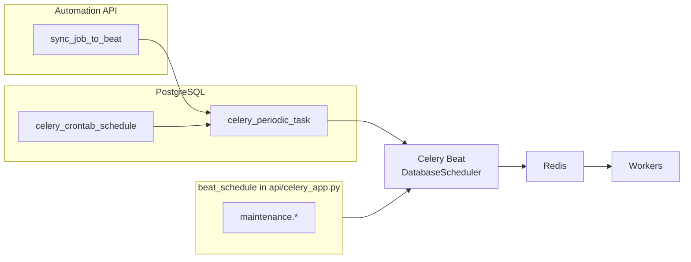

# Automation Jobs & Celery Beat Integration

> **Status**: Implemented (DB-backed Beat for user jobs; maintenance tasks in code)
> **Migration**: `008_create_celery_beat_tables`
> **Updated**: 2026-03-22

## Overview

Automation jobs schedule **sync + template matching + processing** for Zoom recordings. User-defined schedules are stored in PostgreSQL and executed by **Celery Beat** with **`celery-sqlalchemy-scheduler`** (`DatabaseScheduler`).

**Capabilities:**

- Schedule types: `time_of_day`, `hours`, `weekdays`, `cron` (see `api/schemas/automation/schedule.py`)
- Rows in `celery_periodic_task` survive Beat restarts
- Per-job template lists, filters, `processing_config` override
- Manual run and async dry-run (`automation.dry_run`) via Celery

---

## Architecture

### High-level flow

```
┌──────────────────┐
│ automation_jobs  │  CRUD via API (user-owned)
└────────┬─────────┘
         │ create / update / (delete removes Beat row)
         ▼
┌──────────────────┐
│   beat_sync.py   │  Cron string → celery_crontab_schedule;
│                  │  upsert celery_periodic_task (name, task, args, enabled)
└────────┬─────────┘
         ▼
┌──────────────────┐
│  Celery Beat     │  DatabaseScheduler: installs beat_schedule, then reads
│  (one process)   │  enabled rows from celery_periodic_task
└────────┬─────────┘
         │ enqueue
         ▼
┌──────────────────┐
│  Redis broker    │
└────────┬─────────┘
         ▼
┌──────────────────┐
│ Celery worker    │  Queue: `async_operations` (see `task_routes` in
│ (async pool)     │  `api/celery_app.py`)
└──────────────────┘
```

### Two sources of periodic work

1. **`celery_app.conf.beat_schedule`** (`api/celery_app.py`) — maintenance tasks (UTC crontabs): `maintenance.cleanup_expired_tokens`, `maintenance.auto_expire_recordings`, `maintenance.cleanup_recording_files`, `maintenance.hard_delete_recordings`. Routed to queue **`maintenance`**.

2. **User automation** — rows written only by **`sync_job_to_beat`**: task **`automation.run_job`**, queue **`async_operations`**.

`DatabaseScheduler` (from **`celery-sqlalchemy-scheduler`**) subclasses Celery’s `Scheduler`. On startup, **`setup_schedule`** applies `beat_schedule` into the database via **`update_from_dict`**, then the active schedule is built from **`celery_periodic_task`** (see `DatabaseScheduler.all_as_schedule` in the library). So maintenance and automation **share** `celery_periodic_task` after Beat has started; they differ by **how** rows appear (code install vs API).



### Database tables

**App tables**

- `automation_jobs` — job definition, stats (`last_run_at`, `next_run_at`, `run_count`), unique `(user_id, name)` (migration `015`)

**`celery-sqlalchemy-scheduler` tables** (migration `008`)

- `celery_periodic_task` — name, task, `crontab_id`, `args`, `enabled`, …
- `celery_crontab_schedule` — minute/hour/day/month/day_of_week + `timezone`
- `celery_interval_schedule`, `celery_solar_schedule` — unused by current `beat_sync` (crontab only)
- `celery_periodic_task_changed` — scheduler change notifications

---

## Schedule types

Schemas live in `api/schemas/automation/schedule.py`. Default timezone is **`Europe/Moscow`** where not specified.

### 1. `time_of_day` — daily at local time

```json
{
  "type": "time_of_day",
  "time": "06:00",
  "timezone": "Europe/Moscow"
}
```

Cron: `MM HH * * *` (minute first in DB).

### 2. `hours` — every N hours

```json
{
  "type": "hours",
  "hours": 6,
  "timezone": "UTC"
}
```

Cron: `0 */N * * *` with `1 <= N <= 24`.

### 3. `weekdays` — selected weekdays + time

```json
{
  "type": "weekdays",
  "days": [0, 2, 4],
  "time": "09:30",
  "timezone": "Europe/Moscow"
}
```

**Days:** `0 = Monday` … `6 = Sunday`. Implementation maps to cron’s `day_of_week` (Sunday=0 in cron) via `(day + 1) % 7`.

### 4. `cron` — raw expression

```json
{
  "type": "cron",
  "expression": "*/15 * * * *",
  "timezone": "UTC"
}
```

---

## Job payload (summary)

| Field | Notes |
|--------|--------|
| `name` | Required; unique per user |
| `template_ids` | Non-empty; templates validated (active, not draft) |
| `schedule` | Discriminated union above |
| `sync_config.sync_days` | 1–30, default `2` |
| `filters` | Optional; `AutomationFilters` defaults: `status=["INITIALIZED"]`, `exclude_blank=true` |
| `processing_config` | Optional dict override for pipeline |

Full Pydantic models: `api/schemas/automation/job.py`.

---

## API (`api/routers/automation.py`)

| Method | Path | Notes |
|--------|------|--------|
| `POST` | `/api/v1/automation/jobs` | Creates job → `sync_job_to_beat` |
| `GET` | `/api/v1/automation/jobs` | **Paginated** list (`page`, `per_page`, `sort_by`, `sort_order`, `active_only`) |
| `GET` | `/api/v1/automation/jobs/{job_id}` | Full job |
| `PATCH` | `/api/v1/automation/jobs/{job_id}` | Updates → `sync_job_to_beat` |
| `DELETE` | `/api/v1/automation/jobs/{job_id}` | `remove_job_from_beat` then delete row |
| `POST` | `/api/v1/automation/jobs/{job_id}/run` | `dry_run=true` → `automation.dry_run`; else `automation.run_job` |

**Manual / dry-run:** response is `TriggerJobResponse` (`task_id`, `mode`, `message`). Preview and execution are **async Celery tasks** — poll task status/result via your existing tasks API or Celery result backend; the HTTP handler does not return the dry-run estimate body.

---

## Execution (`api/tasks/automation.py`)

Scheduled and manual runs use **`automation.run_job`** (`run_automation_job_task`):

1. Load active, non-draft templates for `template_ids`.
2. Derive **sources to sync** from template `matching_rules.source_ids`: if any template omits or empties `source_ids`, **all** active user sources with credentials are synced; otherwise only listed IDs.
3. For each source, call `_sync_single_source` (same path as manual sync) over `sync_days`.
4. Load recordings in the window, apply `filters`, match templates (`_find_matching_template`), enqueue `run_recording_task` with automation overrides where applicable.
5. Update job stats and `next_run_at` (from `get_next_run_time` + `schedule_to_cron`).

Dry run (`automation.dry_run`) estimates counts without syncing or processing.

---

## When Beat rows are written

| Event | Behavior |
|--------|----------|
| `POST` / `PATCH` job | `sync_job_to_beat` upserts `celery_periodic_task` named `automation_job_{id}`, task `automation.run_job`, `args` JSON `[job_id, user_id]` |
| `DELETE` job | `remove_job_from_beat` deletes that periodic task row |
| API startup | **No** call to `sync_all_jobs_to_beat` in `api/main.py` today |

`sync_all_jobs_to_beat` in `api/helpers/beat_sync.py` is intended for **reconciliation** (e.g. after DB restore or drift). Call it from an admin script or a future lifespan hook if you need full resync.

---

## Celery configuration

### Beat process

```bash
# Foreground (Makefile)
make celery-beat
```

Equivalent:

```bash
PYTHONPATH=$PWD:$PYTHONPATH uv run celery -A api.celery_app beat \
  --loglevel=info \
  --scheduler celery_sqlalchemy_scheduler.schedulers:DatabaseScheduler
```

### Workers

Automation tasks match **`automation.*` → `async_operations`**. You need a worker consuming that queue (e.g. `make celery-async`). Production-style multi-worker start: **`make celery-start`** (writes logs under `logs/`, including `celery-beat.log`).

**Note:** `make celery-dev` runs a worker with **embedded** `beat` and **does not** pass `DatabaseScheduler`. For end-to-end testing of **DB-backed** automation schedules, run **`make celery-beat`** (or `celery-start`) alongside workers.

### Beat DB URI

`beat_dburi` is set to the **sync** SQLAlchemy URL from settings (`api/celery_app.py`), same database as the app.

---

## Implementation reference

| Module | Role |
|--------|------|
| `api/helpers/beat_sync.py` | `sync_job_to_beat`, `remove_job_from_beat`, `sync_all_jobs_to_beat` |
| `api/helpers/schedule_converter.py` | `schedule_to_cron(schedule) -> (cron_expr, human_readable)`; `get_next_run_time(cron_expression, timezone_str)`; `validate_min_interval(cron_expression, min_hours)` |
| `api/services/automation_service.py` | Quotas, duplicate name check, schedule interval validation |

Periodic task row:

- **name:** `automation_job_{id}`
- **task:** `automation.run_job`
- **args:** `[job_id, user_id]` (JSON in DB)

---

## Quotas

Limits come from **subscription / plan** via `QuotaService` (`max_automation_jobs`, `min_automation_interval_hours`), not from a single hardcoded number. `NULL` means unlimited / no minimum. See [QUOTA_AND_ADMIN_API.md](QUOTA_AND_ADMIN_API.md).

---

## Monitoring

### Periodic tasks (automation)

```sql
SELECT name, task, enabled, last_run_at, total_run_count
FROM celery_periodic_task
WHERE name LIKE 'automation_job_%'
ORDER BY id;
```

Join with app jobs (PostgreSQL):

```sql
SELECT aj.id, aj.name, aj.next_run_at, pt.enabled
FROM automation_jobs aj
JOIN celery_periodic_task pt ON pt.name = 'automation_job_' || aj.id::text
WHERE aj.is_active = true
ORDER BY aj.next_run_at NULLS LAST;
```

### Logs

`make celery-start` uses `logs/celery-beat.log` and `logs/celery-async.log` (paths from Makefile).

---

## Migration `008`

File: `alembic/versions/008_create_celery_beat_tables.py`

**Creates tables** listed above; **drops** legacy `celery_schedule` if present.

```bash
uv run alembic upgrade head
```

---

## Troubleshooting

| Symptom | Checks |
|--------|--------|
| Beat not enqueueing user jobs | Process running with `DatabaseScheduler`; `celery_periodic_task.enabled`; `beat_dburi` correct |
| Schedule change not applied quickly | Library reloads when `celery_periodic_task_changed` advances; **restart Beat** after manual SQL edits; if API updates ever seem stale, check that table vs `DatabaseScheduler.schedule_changed` in `celery-sqlalchemy-scheduler` |
| Task never runs | Worker listening on `async_operations`; Redis broker URL; `automation.run_job` registered (`api.tasks.automation` in `include`) |
| Maintenance runs, automation does not | DB rows only created on job create/update — see “When Beat rows are written” |
| Wrong local time | `timezone` in schedule + row in `celery_crontab_schedule`; Celery `timezone`/`enable_utc` in `api/celery_app.py` |

---

## See also

- [CELERY_WORKERS_GUIDE.md](CELERY_WORKERS_GUIDE.md) — queues, pools, processes
- [TEMPLATES.md](TEMPLATES.md) — templates and matching
- [QUOTA_AND_ADMIN_API.md](QUOTA_AND_ADMIN_API.md) — automation quotas
- [TECHNICAL.md](../TECHNICAL.md) — broader API reference
