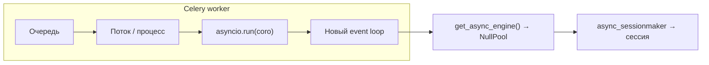

# Celery и asyncio: как устроено в проекте

**Операции (запуск воркеров, логи):** [CELERY_WORKERS_GUIDE.md](CELERY_WORKERS_GUIDE.md)

Кратко: async-код в задачах Celery выполняется через **`asyncio.run()`** в **thread pool** (или в дочернем процессе prefork), а доступ к БД в воркере — через **`NullPool`**, чтобы не привязывать пул соединений к «чужому» event loop.

---

## Содержание

1. [Симптомы и причина](#симптомы-и-причина)
2. [Почему gevent и asyncio конфликтуют](#почему-gevent-и-asyncio-конфликтуют)
3. [Выбранная архитектура](#выбранная-архитектура)
4. [Реализация в репозитории](#реализация-в-репозитории)
5. [Изоляция и безопасность](#изоляция-и-безопасность)
6. [Продакшен: воркеры и нагрузка на БД](#продакшен-воркеры-и-нагрузка-на-бд)
7. [Чеклист для новых задач](#чеклист-для-новых-задач)

---

## Симптомы и причина

Типичные ошибки при неправильном сочетании Celery + asyncio + asyncpg:

```text
InterfaceError: cannot perform operation: another operation is in progress
RuntimeError: Task got Future attached to a different loop
RuntimeError: Event loop is already running
```

**Корень:** пул соединений SQLAlchemy/asyncpg и объекты, привязанные к одному event loop, переиспользуются в другом потоке/процессе или после смены loop. Отдельно: **gevent** (monkey-patching сокетов) плохо сочетается с **asyncpg**, который ожидает нативные asyncio-сокеты.

---

## Почему gevent и asyncio конфликтуют

- **Gevent** подменяет блокирующие вызовы и даёт кооперативную многозадачность на greenlet’ах.
- **Asyncio** ведёт собственный event loop и ожидает согласованного I/O стека.
- **asyncpg** рассчитан на asyncio; при патченном gevent-сокетном слое возможны `InterfaceError` и странное поведение пула.

Пул соединений `AsyncEngine` привязан к loop, в котором создавался. Если задача создаёт новый loop (`asyncio.run` в другом потоке), старый пул недействителен → «Future attached to a different loop».

---

## Выбранная архитектура

### Очереди и пулы процессов

Маршрутизация задаётся в `api/celery_app.py` (`task_routes`):

| Очередь | Назначение | Рекомендуемый pool |
|---------|------------|-------------------|
| `processing_cpu` | CPU (например, trim) | **prefork** |
| `downloads` | скачивание | **threads** |
| `uploads` | выгрузка на платформы | **threads** |
| `async_operations` | транскрипция, топики, субтитры, пайплайн, шаблоны, sync, automation | **threads** |
| `maintenance` | периодические задачи Beat | **prefork** |

Фрагмент актуальных маршрутов (имена модулей должны совпадать с кодом):

```python
# api/celery_app.py (фрагмент)
celery_app.conf.task_routes = {
    "api.tasks.processing.trim_video": {"queue": "processing_cpu"},
    "api.tasks.processing.download_recording": {"queue": "downloads"},
    "api.tasks.upload.*": {"queue": "uploads"},
    "api.tasks.processing.transcribe_recording": {"queue": "async_operations"},
    "api.tasks.processing.extract_topics": {"queue": "async_operations"},
    "api.tasks.processing.generate_subtitles": {"queue": "async_operations"},
    "api.tasks.processing.batch_transcribe_recording": {"queue": "async_operations"},
    "api.tasks.processing.run_recording": {"queue": "async_operations"},
    "api.tasks.processing.launch_uploads": {"queue": "async_operations"},
    "api.tasks.template.*": {"queue": "async_operations"},
    "api.tasks.sync.*": {"queue": "async_operations"},
    "automation.*": {"queue": "async_operations"},
    "maintenance.*": {"queue": "maintenance"},
}
```

### Команды из Makefile (как в репозитории)

Один воркер на очередь, типичные `--concurrency` для `make celery-start`:

| Воркер | Очередь | pool | concurrency |
|--------|---------|------|---------------|
| downloads | `downloads` | threads | 20 |
| uploads | `uploads` | threads | 20 |
| async | `async_operations` | threads | 28 |
| cpu | `processing_cpu` | prefork | 6 (`--max-tasks-per-child=20`) |
| maintenance | `maintenance` | prefork | 1 |

Локальная разработка: `make celery-dev` — **один** worker на все очереди, **prefork**, `--concurrency=4` (удобно отладить, но не копирует прод-разбиение по процессам/потокам).

### Три опорных механизма

1. **`asyncio.run(coro)`** — на каждый вызов создаётся новый event loop, он же корректно завершается (в отличие от «забытых» `run_until_complete` на общем loop).
2. **`NullPool` в Celery** — нет переиспользования соединений между разными вызовами `asyncio.run()` / разными loop в потоках; каждое обращение к пулу открывает новое соединение под текущий loop.
3. **threads pool** для I/O-задач с asyncio — потоки ОС + изолированные `asyncio.run()` дают предсказуемое поведение без gevent.

---

## Реализация в репозитории

### Поток выполнения (схема)



### `run_async` и базовые классы задач

`asyncio.run()` обёрнут в `BaseTask.run_async()` в `api/tasks/base.py`. От `BaseTask` наследуются `ProcessingTask`, `UploadTask`, `SyncTask`, `TemplateTask`, `AutomationTask` — у всех есть один и тот же механизм запуска корутин.

```40:59:api/tasks/base.py
    def run_async(self, coro: Awaitable[T]) -> T:
        """
        Run async coroutine in Celery worker with proper event loop management.

        Uses asyncio.run() which creates a completely fresh event loop for each task.
        ...
        """
        return asyncio.run(coro)
```

Задачи с `bind=True` обычно вызывают `return self.run_async(_inner())`. В `on_failure` у `ProcessingTask` / `UploadTask` для отката статусов снова вызывается `asyncio.run(...)` — это **отдельный** полный цикл после падения основной корутины, не параллельный с ней.

### Задачи без `bind=True`

В `api/tasks/maintenance.py` корутины запускаются напрямую через `asyncio.run(...)`, без `self.run_async`.

### Движок БД: детекция воркера и `NullPool`

```17:44:api/dependencies.py
def _is_celery_worker() -> bool:
    """Check if running in Celery worker context."""
    if os.getenv("CELERY_WORKER") == "true":
        return True
    if len(sys.argv) > 0:
        argv_str = " ".join(sys.argv)
        if "celery" in argv_str and "worker" in argv_str:
            return True

    return False


def get_async_engine():
    ...
    if _is_celery_worker():
        return create_async_engine(settings.database.url, echo=False, poolclass=NullPool)
    return _get_cached_engine()
```

- Явная установка **`CELERY_WORKER=true`** (если используется у вас в деплое) тоже переводит процесс в режим `NullPool`.
- Для **FastAPI** используется `_get_cached_engine()` с `@lru_cache` — один engine на процесс веб-сервера. Параметры `pool_size` / `max_overflow` заданы в `config/settings.py` (`DatabaseSettings`), но **в текущем `create_async_engine` в `dependencies.py` не передаются**; фактически действуют **дефолты SQLAlchemy** для async-движка. Имеет смысл при настройке лимитов PostgreSQL ориентироваться на реальные дефолты или подключить поля из settings к `create_async_engine`.

### Сессии в задачах

Паттерн в задачах: `get_async_session_maker()` → `async with session_maker() as session`. Имена в коде — не `get_session`, а фабрика из `api.dependencies`.

---

## Изоляция и безопасность

| Уровень | Что даёт |
|---------|----------|
| Новый loop на каждый `asyncio.run()` | Нет смешивания Future’ов между задачами в разных потоках. |
| `NullPool` в воркере | Нет общего пула соединений, привязанного к «старому» loop. |
| Транзакции PostgreSQL | Изоляция между параллельными сессиями — на стороне СУБД. |

**GIL:** для I/O-bound задач потоки полезны: ожидание сети/БД отпускает GIL. CPU-bound вынесены в `processing_cpu` + prefork.

Отдельно: утверждение «async SQLAlchemy session thread-local как у sync ORM» для async-стека вводит в заблуждение; здесь важнее **не переиспользовать один `AsyncSession` между разными `asyncio.run()`**, а создавать сессию внутри корутины, привязанной к текущему loop.

---

## Продакшен: воркеры и нагрузка на БД

### Суммарная конкуррентность (ориентир)

При полном `make celery-start` без горизонтального масштабирования:

- threads: до **20 + 20 + 28 = 68** одновременных задач на очередях downloads / uploads / async (каждая может открыть соединение при работе с БД при `NullPool`);
- prefork cpu: **6** процессов;
- maintenance: **1**.

Пиковое число соединений к PostgreSQL зависит от того, сколько задач реально держат сессию БД одновременно; при `NullPool` разумно закладывать запас по `max_connections` и мониторить `pg_stat_activity`.

### Мониторинг

- Очереди и воркеры: `celery -A api.celery_app inspect active` (см. также `make celery-status`).
- Долгие запросы и число соединений — стандартные запросы к `pg_stat_activity`.

---

## Чеклист для новых задач

1. **Маршрут:** CPU-bound → `processing_cpu`; сеть/БД/async → соответствующая очередь из таблицы выше; не класть asyncio-задачи на gevent-pool.
2. **Запуск корутины:** `self.run_async(...)` (если `base=BaseTask` / `ProcessingTask` / …) или `asyncio.run(...)` для обычных `@celery_app.task` без `self`.
3. **Не использовать:** ручной `get_event_loop()` + `run_until_complete()` для прод-кода задач.
4. **Сессия:** `async with session_maker() as session` внутри корутины; не хранить сессию между вызовами `asyncio.run()`.
5. **Проверить имя задачи** в `task_routes`, если добавляется новый модуль/префикс.

### Деплой воркеров (ссылка на Makefile)

Остановка/запуск: `make celery-stop`, `make celery-start` (не `celery-all`). Логи по умолчанию: `logs/celery-async.log`, `logs/celery-cpu.log`, и т.д.

---

## Связанные документы

- [CELERY_WORKERS_GUIDE.md](CELERY_WORKERS_GUIDE.md) — запуск, очереди, отладка
- [TECHNICAL.md](../TECHNICAL.md) — API и поведение сервиса
- [DEPLOYMENT.md](DEPLOYMENT.md) — выкладка

---

**Версии:** Python 3.14+ (требование пакета), Celery 5.x, SQLAlchemy 2.x async.

**Обновлено:** 2026-03-22
