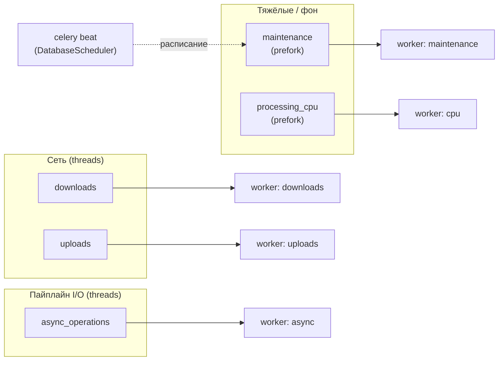

# Celery Workers: Operations Guide

> **Быстрый старт (все воркеры в фоне):** `make celery-start` (поднимает Redis через Homebrew, затем 5 worker-процессов + beat)  
> **Техника asyncio + threads:** [CELERY_ASYNCIO_TECHNICAL.md](CELERY_ASYNCIO_TECHNICAL.md)  
> **Маршрутизация в коде:** `api/celery_app.py` → `task_routes`

## Overview

Очереди разделены по типу нагрузки: сеть (скачивание / загрузка), быстрый I/O пайплайна (транскрипция, оркестрация), CPU (FFmpeg), обслуживание. Источник правды по именам очередей и задач — `api/celery_app.py`.



---

## Очереди и команды Makefile

| Очередь | Pool | Concurrency (Makefile) | Команда |
|---------|------|--------------------------|---------|
| `downloads` | threads | 20 | `make celery-downloads` |
| `uploads` | threads | 20 | `make celery-uploads` |
| `async_operations` | threads | 28 | `make celery-async` |
| `processing_cpu` | prefork | 6 (`--max-tasks-per-child=20`) | `make celery-cpu` |
| `maintenance` | prefork | 1 | `make celery-maintenance` |

Планировщик: `make celery-beat` — `--scheduler celery_sqlalchemy_scheduler.schedulers:DatabaseScheduler` (периодика автоматизаций в БД **и** статическое расписание из `beat_schedule` в `api/celery_app.py`).

---

## Маршрутизация задач (по факту `task_routes`)

| Очередь | Задачи (имена Celery) |
|---------|------------------------|
| `processing_cpu` | `api.tasks.processing.trim_video` |
| `downloads` | `api.tasks.processing.download_recording` |
| `uploads` | `api.tasks.upload.*` (`upload_recording_to_platform`, `batch_upload_recordings`) |
| `async_operations` | `api.tasks.processing.transcribe_recording`, `extract_topics`, `generate_subtitles`, `batch_transcribe_recording`, `run_recording`, `launch_uploads`; `api.tasks.template.*`; `api.tasks.sync.*`; `automation.*` (`automation.run_job`, `automation.dry_run`) |
| `maintenance` | `maintenance.*` — `cleanup_expired_tokens`, `auto_expire_recordings`, `cleanup_recording_files`, `hard_delete_recordings` |

**Зачем отдельные `downloads` и `uploads`:** изоляция сетевой полосы и долгих передач от остального I/O пайплайна (см. комментарии в `api/celery_app.py`).

**Почему threads для сети и пайплайна:** совместимость с asyncio/asyncpg в воркере; gevent здесь не используется — см. [CELERY_ASYNCIO_TECHNICAL.md](CELERY_ASYNCIO_TECHNICAL.md).

**Почему prefork для CPU:** обход GIL, изоляция процессов; для FFmpeg-тримминга.

**Почему один процесс maintenance:** последовательное выполнение фоновых чисток снижает гонки; периодика задаётся в `beat_schedule` (UTC).

---

## Запуск

### Все воркеры + beat (фон)

```bash
make celery-start   # Redis (brew) + 5 workers + beat, логи в logs/
make celery-stop
make celery-status
make celery-purge    # очистить очереди (осторожно)
```

### Ручной запуск по терминалам (разработка)

```bash
make celery-downloads
make celery-uploads
make celery-async
make celery-cpu
make celery-maintenance
make celery-beat
```

### Один процесс на все очереди (только локально)

`make celery-dev` — один worker, очереди `processing_cpu,async_operations,downloads,uploads,maintenance`, **prefork**, concurrency 4. Удобно для отладки, не отражает прод-разбиение по процессам.

### Мониторинг

```bash
make flower   # http://localhost:5555
```

---

## Масштабирование

- **Вертикально:** поднимать `--concurrency` у нужной очереди (типично — `async_operations`, затем `downloads`/`uploads` при узком месте сети).
- **Горизонтально:** несколько машин с теми же именами очередей; Redis как общий broker.
- **CPU pool:** ориентир — не больше числа ядер для FFmpeg; `max-tasks-per-child` уже задан для prefork CPU-воркера в Makefile.

Табличные «размеры под N пользователей» зависят от профиля нагрузки; ориентируйтесь на длину очередей (Flower / `inspect active`) и latency задач.

---

## Отличия Docker Compose

В `docker-compose.yml` один контейнер `celery_worker` слушает **все** очереди (`downloads,uploads,async_operations,processing_cpu,maintenance`) с `--concurrency=8`, **без** `--pool` → используется pool по умолчанию Celery (**prefork**). В Makefile сетевые и пайплайновые очереди обрабатываются **threads**-воркерами. Для продакшена при необходимости выровняйте схему (несколько сервисов с `-Q` и нужным `--pool`, как в Makefile).

---

## Настройки из окружения

Префикс `CELERY_` в `config/settings.py` (`CelerySettings`): broker/backend, лимиты времени, prefetch, retries по типам задач. Broker по умолчанию синхронизируется с Redis из общих настроек (`sync_redis_to_celery`).

---

## Troubleshooting

| Симптом | Куда смотреть |
|---------|----------------|
| Задачи не берутся | `make celery-status`, логи `logs/celery-*.log`, что воркер подписан на нужную очередь (`-Q`) |
| Задача в «не той» очереди | Имя задачи и `task_routes` в `api/celery_app.py` |
| InterfaceError / asyncio | [CELERY_ASYNCIO_TECHNICAL.md](CELERY_ASYNCIO_TECHNICAL.md) |
| Beat не отрабатывает | Процесс beat запущен; для DB-расписания — миграции и `beat_dburi`; статика — `beat_schedule` |

---

## Сводка

| Процессов worker (Makefile) | 5 + отдельный beat |
|----------------------------|---------------------|
| Пример суммарной параллельности | 20 + 20 + 28 + 6 + 1 = **75** слотов (6 — дочерние процессы prefork CPU) |

---

## Связанные документы

- [CELERY_ASYNCIO_TECHNICAL.md](CELERY_ASYNCIO_TECHNICAL.md) — asyncio, NullPool, threads  
- [TECHNICAL.md](../TECHNICAL.md) — API  
- [DEPLOYMENT.md](DEPLOYMENT.md) — выкладка

**Последнее обновление:** 2026-03-22
