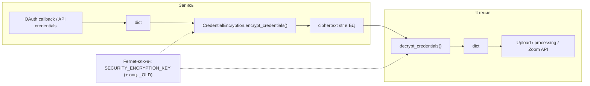

# Credential Security

Документ описывает **шифрование пользовательских OAuth-токенов** (Zoom, YouTube, VK), хранящихся в PostgreSQL. Настройка OAuth-приложений и callback — в [OAUTH.md](OAUTH.md).

## Границы ответственности

| Что | Где хранится | Защита |
|-----|----------------|--------|
| Токены пользователей (после OAuth / ручного ввода) | Таблица `user_credentials`, поле `encrypted_data` | Fernet (`api/auth/encryption.py`) |
| Ключи AI (Fireworks ASR, DeepSeek и т.д.) | JSON: `config/fireworks_creds.json`, `config/deepseek_creds.json`, … | Не шифруются приложением; файл вне VCS, права ОС. Шаблоны: `config/examples/*.json.example` |
| Секреты OAuth-приложения (client id/secret для провайдера) | `.env`: `OAUTH_*`, плюс опционально `OAUTH_BASE_URL` | Env; не путать с токенами пользователя в БД |
| JWT, пароль БД, Redis, S3 | `.env` / секреты оркестратора | См. `.env.example` |

## Архитектура (пользовательские credentials)



Схема шифрования: **Fernet** (AES-128-CBC + HMAC-SHA256), ключ — **base64, 32 байта** после декодирования (валидатор в `SecuritySettings` в `config/settings.py`).

Реализация: класс `CredentialEncryption` в `api/auth/encryption.py`, доступ через `get_encryption()` (singleton на процесс).

## Расшифровка и lazy re-encrypt

1. **`decrypt_credentials`** перебирает ключи в порядке: **текущий (`SECURITY_ENCRYPTION_KEY`) → старый (`SECURITY_ENCRYPTION_KEY_OLD`)**. Первый успешный расшифровка — результат; иначе `ValueError` с текстом про переподключение аккаунта.

2. **`needs_reencrypt`** проверяет только **текущим** ключом: если не расшифровывает — данные ещё на старом ключе, нужна перешифровка.

3. **`CredentialService`** (`api/services/credential_service.py`) после успешной расшифровки вызывает `_reencrypt`, если `needs_reencrypt` истинно: записывает в БД новый ciphertext **только текущим** ключом (lazy re-encrypt).

Генерация ключа:

```bash
python -c "from cryptography.fernet import Fernet; print(Fernet.generate_key().decode())"
```

## Ротация ключей

**Цель:** все записи в БД читаются новым ключом; старый ключ можно убрать из env.

### Вариант A — переходный период без немедленной массовой миграции

1. Сгенерировать новый Fernet-ключ.
2. В `.env` одновременно:
   - `SECURITY_ENCRYPTION_KEY=<новый>`
   - `SECURITY_ENCRYPTION_KEY_OLD=<старый>`
3. Перезапустить **API и все воркеры Celery** (singleton шифрования; разный env в процессах = типичная причина ошибок).
4. По мере чтения credentials `CredentialService` перешифрует записи на новый ключ.
5. Опционально ускорить: скрипт массовой миграции (см. ниже).
6. Удалить `SECURITY_ENCRYPTION_KEY_OLD` после того, как убедились, что все строки на новом ключе.

### Вариант B — скрипт `scripts/reencrypt_credentials.py`

Скрипт **не** читает `SECURITY_ENCRYPTION_KEY_OLD`. Он использует:

| Переменная | Назначение |
|------------|------------|
| `SECURITY_ENCRYPTION_KEY` | Ключ, **которым будет записан** новый ciphertext (целевой текущий ключ) |
| `OLD_ENCRYPTION_KEY` | Если задан — им **расшифровываются** существующие строки. Если **пусто** — для расшифровки берётся тот же `SECURITY_ENCRYPTION_KEY` (режим «перешифровать тем же ключом», например снятие префикса `v2:` у legacy-формата в БД) |

Типичный сценарий смены ключа: в окружении запуска скрипта выставить `OLD_ENCRYPTION_KEY=<старый>` и `SECURITY_ENCRYPTION_KEY=<новый>`, затем:

```bash
uv run python scripts/reencrypt_credentials.py --dry-run
uv run python scripts/reencrypt_credentials.py
```

После успешного прогона в runtime достаточно одного `SECURITY_ENCRYPTION_KEY` (нового); `SECURITY_ENCRYPTION_KEY_OLD` для этих данных не нужен.

**Lazy re-encrypt в `CredentialService`** — подстраховка между обновлением env и запуском скрипта, не замена согласованной ротации.

## Troubleshooting

### «Credentials could not be decrypted» / смена ключа без `_OLD`

Причины те же, что у несовпадения ключа:

| Ситуация | Что проверить |
|----------|----------------|
| Разные процессы | Один и тот же `.env` / секреты для API и Celery |
| Смена ключа | Были ли `SECURITY_ENCRYPTION_KEY_OLD` или `OLD_ENCRYPTION_KEY` + скрипт |
| Окружения | Локальный `.env` vs Docker / staging / production |

**Если старый ключ утерян:** удалить credential в UI (**Settings → Credentials**) и пройти OAuth снова (см. [OAUTH.md](OAUTH.md)).

### Префикс `v2:` в `encrypted_data`

Массовая миграция в `reencrypt_credentials.py` снимает префикс `v2:` перед расшифровкой. Обычный путь приложения в `CredentialEncryption` префикс **не** обрабатывает; legacy-строки с `v2:` нужно привести к виду без префикса через скрипт или пересохранение credential.

## Production checklist

- [ ] `APP_DEBUG=false` (иначе не сработает строгая проверка: JWT по умолчанию и пустой `SECURITY_ENCRYPTION_KEY` допустимы только вне strict production — см. `Settings.validate_production_settings` в `config/settings.py`)
- [ ] `SECURITY_JWT_SECRET_KEY` — не значение по умолчанию из примера
- [ ] `SECURITY_ENCRYPTION_KEY` задан и совпадает во всех процессах, имеющих доступ к БД с credentials
- [ ] Пароли БД/Redis и ключи S3 не в репозитории; AI JSON-файлы с API keys — в `.gitignore`, права только для пользователя сервиса
