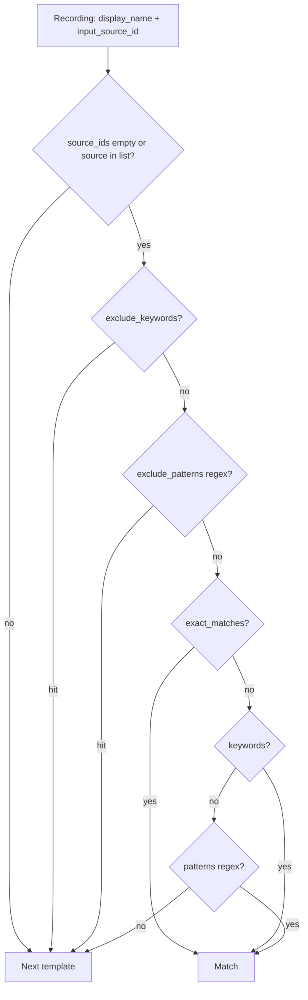

# Templates, Presets & Sources

**Product:** LEAP

Reference for **input sources**, **output presets**, and **recording templates** as implemented in `api/schemas/template/` and template matching in `api/routers/input_sources.py`.

---

## Table of Contents

1. [Input Sources](#input-sources)
2. [Output Presets](#output-presets)
3. [Recording Templates](#recording-templates)
4. [Matching Logic](#matching-logic)
5. [Examples](#examples)
6. [API](#api)
7. [Troubleshooting](#troubleshooting)

---

## Input Sources

An input source defines where recordings are ingested from (Zoom, Google Drive, Yandex Disk, yt-dlp URLs, local files).

### Create vs response field names

| Context | Platform field |
|---------|----------------|
| **POST** body | `platform`: `ZOOM` \| `GOOGLE_DRIVE` \| `YANDEX_DISK` \| `VIDEO_URL` \| `LOCAL` |
| **GET** response | `source_type`: same value as stored in the DB |

### Response shape (representative)

```json
{
  "id": 1,
  "user_id": "01HX...",
  "name": "My Zoom Account",
  "description": "Main Zoom account for lectures",
  "source_type": "ZOOM",
  "credential_id": 1,
  "is_active": true,
  "last_sync_at": "2024-01-15T10:00:00Z",
  "created_at": "2024-01-15T10:00:00Z",
  "updated_at": "2024-01-15T10:00:00Z",
  "config": {}
}
```

### Create parameters (`InputSourceCreate`)

| Field | Type | Required | Notes |
|-------|------|----------|-------|
| `name` | string(3–255) | yes | |
| `description` | string(0–1000) | no | |
| `platform` | enum | yes | See table above |
| `credential_id` | int > 0 | conditional | Rules below |
| `config` | discriminated union | no | Platform-specific |

**Credentials:**

- `LOCAL` and `VIDEO_URL` — no `credential_id` (validator rejects `credential_id` on `LOCAL`).
- `ZOOM`, `GOOGLE_DRIVE` — `credential_id` required.
- `YANDEX_DISK` — `credential_id` required **unless** `config` uses `public_url` (OAuth not needed for public links).

### Platform configs

#### ZOOM (`ZoomSourceConfig`)

```json
{
  "user_id": "me",
  "include_trash": false,
  "recording_type": "cloud",
  "is_master_account": false,
  "user_emails": null
}
```

| Field | Default | Description |
|-------|---------|-------------|
| `user_id` | null | Zoom user filter; `null` = all users under the account |
| `include_trash` | false | Include deleted recordings |
| `recording_type` | `"cloud"` | `"cloud"` or `"all"` |
| `is_master_account` | false | Sync master + sub-accounts |
| `user_emails` | null | Required when `is_master_account` is true; omit when false |

#### Google Drive (`GoogleDriveSourceConfig`)

```json
{
  "folder_id": "1abc...xyz",
  "recursive": true,
  "file_pattern": ".*\\.mp4$"
}
```

| Field | Required | Description |
|-------|----------|---------------|
| `folder_id` | yes | Folder ID |
| `recursive` | no (default true) | Descend into subfolders |
| `file_pattern` | no | Regex on file names |

#### Yandex Disk (`YandexDiskSourceConfig`)

Exactly one mode: **either** OAuth folder path **or** public URL (mutually exclusive).

```json
{
  "folder_path": "/Video/Lectures",
  "recursive": true,
  "file_pattern": "Лекция.*\\.mp4"
}
```

```json
{
  "public_url": "https://disk.yandex.ru/d/AbCdEf123",
  "recursive": true,
  "file_pattern": null
}
```

| Field | Description |
|-------|---------------|
| `folder_path` | Path on Disk (with OAuth) |
| `public_url` | Public file/folder link |
| `recursive` | Default true |
| `file_pattern` | Regex on file names |

#### VIDEO_URL (`VideoUrlSourceConfig`) — yt-dlp

```json
{
  "url": "https://www.youtube.com/watch?v=...",
  "video_platform": null,
  "is_playlist": false,
  "quality": "best",
  "format_preference": "mp4"
}
```

| Field | Description |
|-------|-------------|
| `url` | Video or playlist URL |
| `video_platform` | Optional; auto-detected if omitted |
| `is_playlist` | Treat URL as playlist/channel |
| `quality` | `best` \| `1080p` \| `720p` \| `480p` |
| `format_preference` | `mp4` \| `mp3` \| `audio` \| `any` |

#### LOCAL (`LocalFileSourceConfig`)

Empty object `{}`.

---

## Output Presets

Presets define upload targets and platform metadata (title/description templates, thumbnails, etc.).

### Response shape (representative)

```json
{
  "id": 1,
  "user_id": "01HX...",
  "name": "YouTube Main Channel",
  "description": "Main channel for course lectures",
  "platform": "youtube",
  "credential_id": 1,
  "is_active": true,
  "created_at": "2024-01-15T10:00:00Z",
  "updated_at": "2024-01-15T10:00:00Z",
  "preset_metadata": {}
}
```

### Create parameters

| Field | Type | Required | Description |
|-------|------|----------|-------------|
| `name` | string(1–255) | yes | |
| `description` | string(0–1000) | no | |
| `platform` | `"youtube"` \| `"vk"` | yes | Literal in `OutputPresetBase` |
| `credential_id` | int > 0 | yes | Platform credential |
| `preset_metadata` | YouTube or VK | yes | See below |

`YandexDiskPresetMetadata` also exists in `preset_metadata.py`, but the **presets router** only accepts `platform: "youtube" | "vk"`. If Yandex Disk output is added to the API, this section should be updated.

### YouTube preset metadata (`YouTubePresetMetadata`)

| Field | Default | Notes |
|-------|---------|-------|
| `title_template`, `description_template` | null | Placeholders: `{display_name}`, `{themes}`, `{summary}`, … |
| `privacy` | `unlisted` | `public` \| `private` \| `unlisted` |
| `made_for_kids` | false | COPPA |
| `embeddable` | true | Third-party embedding |
| `category_id` | `"27"` | Numeric string |
| `license` | `youtube` | `youtube` \| `creativeCommon` |
| `default_language` | null | e.g. `ru`, `en` |
| `playlist_id` | null | |
| `tags` | null | List length capped at 500 in schema |
| `thumbnail_name` | null | Filename only; resolved under the user’s thumbnail directory |
| `topics_display`, `questions_display` | null | Formatting for description blocks |
| `publish_at` | null | ISO 8601 scheduled publish |
| `disable_comments`, `rating_disabled`, `notify_subscribers` | see schema | |

### VK preset metadata (`VKPresetMetadata`)

`privacy_view` / `privacy_comment` (0–3), `group_id`, `album_id`, `thumbnail_name`, `topics_display`, `questions_display`, `repeat`, `compression`, `wallpost`, `disable_comments` — full field list in `preset_metadata.py`.

### Topics / questions display

Shared models: `TopicsDisplayConfig`, `QuestionsDisplayConfig`.

- Topics: `enabled` defaults to **true**. Questions: `enabled` defaults to **false** (backward compatible).
- Formats: `numbered_list`, `bullet_list`, `dash_list`, `comma_separated`, `inline`.

---

## Recording Templates

Templates connect **matching rules** to **processing**, **publish metadata**, and **output presets**.

### Core fields

| Field | Description |
|-------|-------------|
| `name` | string(3–255), required |
| `description` | up to 1000 chars |
| `is_draft` | Drafts are not auto-matched |
| `is_active` | Enabled |
| `matching_rules` | Required for non-draft (see validation) |
| `processing_config` | Transcription, topics, subtitles |
| `metadata_config` | Title/description templates, thumbnails, per-platform overrides |
| `output_config` | `preset_ids`, `auto_upload`, `upload_captions` |

**Create validation (`RecordingTemplateCreate`):**

- Non-draft → `matching_rules` present and at least one of: non-empty `exact_matches`, `keywords`, `patterns`, or `source_ids`.
- `output_config.auto_upload == true` → `processing_config` required.
- `metadata_config.title_template` set → `output_config` with `preset_ids` required.

### Matching rules (`MatchingRules`)

Excludes run **before** positive rules.

| Field | Role |
|-------|------|
| `exact_matches` | Exact display name match (after case normalization per flag) |
| `keywords` | Substring match, OR across list |
| `patterns` | Regex match, OR across list |
| `source_ids` | **Filter only**: recording must belong to one of these input sources |
| `exclude_keywords` | Substring → skip this template |
| `exclude_patterns` | Regex → skip this template |
| `case_sensitive` | Applies to exact, keywords, excludes, patterns |

**Runtime caveat:** `_find_matching_template` only **returns** a template when `exact_matches`, `keywords`, or `patterns` matches. `source_ids` alone never yields a match — it only narrows candidates. To match “everything from source X”, add a positive name rule such as `"patterns": [".*"]` together with `source_ids`.

### Processing config (`TemplateProcessingConfig`)

Nested `transcription` is required (`TranscriptionProcessingConfig`).

| Field | Default | Description |
|-------|---------|-------------|
| `enable_transcription` | true | |
| `prompt` | null | ASR hint; empty → default prompt from codebase |
| `language` | null | Audio language |
| `allow_errors` | false | On transcription error, continue pipeline (topics/subtitles skipped) |
| `enable_topics` | true | Topic extraction |
| `granularity` | `long` | `short` \| `medium` \| `long` |
| `questions_count` | 3 | 1–10 self-check questions |
| `vocabulary` | null | Terms inside `transcription` |
| `enable_subtitles` | true | |
| `transcription_vocabulary` | null | Extra terms at template level (merged at config resolve) |

### Metadata config (`TemplateMetadataConfig`)

Thumbnail precedence (from schema docstring):

1. `youtube.thumbnail_name` / `vk.thumbnail_name`
2. Common `thumbnail_name`
3. Preset thumbnail

Blocks: `vk`, `youtube`, `yandex_disk` (`folder_path_template`, `filename_template`).

**Common template variables** in descriptions: `{display_name}`, `{themes}`, `{topic}`, `{topics}`, `{topics_list}`, `{summary}`, `{questions}`, `{record_time}`, `{publish_time}`, `{date}`, `{duration}`; date styles like `{record_time:DD.MM.YY}`.

**`title_template` API validation:** the string must contain at least one of: `{display_name}`, `{themes}`, `{topic}`, `{date}`, `{record_time}`, `{duration}` (`TemplateMetadataConfig.validate_title_template`). A title containing only `{summary}` or `{topics}` without those tokens **fails** validation.

### Output config (`TemplateOutputConfig`)

| Field | Description |
|-------|-------------|
| `preset_ids` | 1–10 unique positive integers |
| `auto_upload` | default false |
| `upload_captions` | default true |

---

## Matching Logic

### Template order

`RecordingTemplateRepository.find_active_by_user` orders by **`created_at ASC`**. First matching template wins.

### Per-template checks



### Case sensitivity

- `case_sensitive == false` (default): non-regex comparisons use lowercased strings; regex uses `re.IGNORECASE` when case-insensitive.
- `case_sensitive == true`: case-sensitive comparisons and regex without `IGNORECASE`.

---

## Examples

### Catch-all with exclusions

Use `"patterns": [".*"]` for “any name”; do not rely on `source_ids` alone.

### Multi-platform upload

`output_config.preset_ids: [1, 2]` with `auto_upload: true` triggers upload flows for each preset after processing (see upload tasks in the codebase).

---

## API

Router prefixes in code:

| Resource | Base path |
|----------|-----------|
| Input sources | `/api/v1/sources` |
| Output presets | `/api/v1/presets` |
| Recording templates | `/api/v1/templates` |

### Sources

| Method | Path | Notes |
|--------|------|-------|
| GET | `/api/v1/sources` | Pagination, `search`, `active_only`, `platform`, sort |
| POST | `/api/v1/sources` | Create |
| POST | `/api/v1/sources/bulk/sync` | `BulkSyncRequest`: `source_ids`, `from_date`, `to_date` |
| GET | `/api/v1/sources/{source_id}` | |
| PATCH | `/api/v1/sources/{source_id}` | |
| DELETE | `/api/v1/sources/{source_id}` | |
| POST | `/api/v1/sources/{source_id}/sync` | Single-source sync |

### Presets

| Method | Path |
|--------|------|
| GET | `/api/v1/presets` |
| POST | `/api/v1/presets` |
| GET | `/api/v1/presets/{preset_id}` |
| PATCH | `/api/v1/presets/{preset_id}` |
| DELETE | `/api/v1/presets/{preset_id}` |
| POST | `/api/v1/presets/bulk/delete` |

### Templates

| Method | Path | Notes |
|--------|------|-------|
| GET | `/api/v1/templates` | `include_drafts`, `is_active`, name search |
| POST | `/api/v1/templates` | Query `auto_rematch` (default true) |
| POST | `/api/v1/templates/from-recording/{recording_id}` | `TemplateFromRecordingRequest` |
| GET | `/api/v1/templates/{template_id}` | |
| PATCH | `/api/v1/templates/{template_id}` | |
| DELETE | `/api/v1/templates/{template_id}` | |
| POST | `/api/v1/templates/bulk/delete` | |
| GET | `/api/v1/templates/{template_id}/stats` | |
| POST | `/api/v1/templates/{template_id}/preview` | Match preview |
| POST | `/api/v1/templates/{template_id}/rematch` | Queue rematch task |

---

## Troubleshooting

| Symptom | What to check |
|---------|----------------|
| Recording not matched | `is_active`, not draft; `source_ids` filter; exclude rules; **positive** rule present; template order (`created_at`) |
| “All from source X” does not work | Add `patterns`/`keywords`/`exact_matches` — `source_ids` alone does not match |
| `title_template` validation error | Must include at least one of `{display_name}`, `{themes}`, `{topic}`, `{date}`, `{record_time}`, `{duration}` (see Metadata config) |
| Upload fails | `auto_upload`, valid preset credentials, platform limits |

---

## See also

- [TECHNICAL.md](../TECHNICAL.md) — architecture and API overview  
- [DEPLOYMENT.md](./DEPLOYMENT.md) — deployment  
